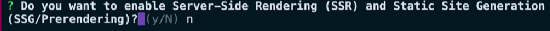
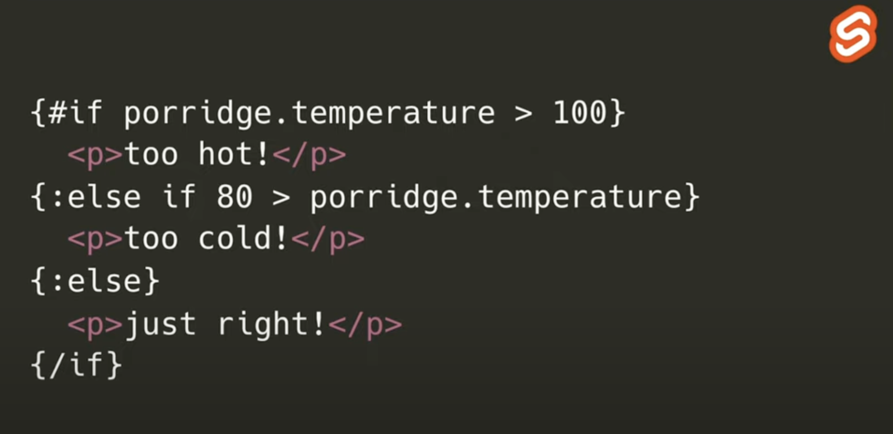

# Sección 1: Introducción al curso

## Tabla de Contenido
1. [Nota Actualización](#nota-actualización)
2. [Angular V17: Nueva sintaxis](#angular-v17-nueva-sintaxis)
    - 2.1. [Sintaxis ngIf](#sintaxis-ngif)
    - 2.2. [Sintaxis ngFor](#sintaxis-ngfor)
    - 2.3. [Sintaxis ngSwitch](#sintaxis-ngswitch)
    - 2.4. [Sintaxis if con ngFor o ngIf](#sintaxis-if-con-ngfor-o-ngif)
    - 2.5. [Sintaxis @defer](#sintaxis-defer)
    - 2.6. [Cómo usar la nueva sintaxis](#¿cómo-usar-la-nueva-sintaxis)
    - 2.7. [Cuál es la base de esta nueva sintaxis](#¿cuál-es-la-base-de-esta-nueva-sintaxis)
3. [Recursos Adicionales](#recursos-adicionales)


## Nota Actualización

- `ng new "name>project" --standalone false` -> Crear proyecto tradicional



## Angular V17: Nueva sintaxis
Los cambios son en los templates, ya que la lógica sigue siendo la misma. Veamos cómo cambiaría la sintaxis para mostrar un elemento u otro dependiendo de una condición.

### Sintaxis ngIf

**Antes:**
```html
<h1 *ngIf="age >= 18; else elseBlock">You are over 18</h1>
<ng-template #elseBlock>
  <h1>you are under 18</h1>
</ng-template>
```

**Ahora:**
```html
@if (age >= 18) {
	<h1>You are over 18</h1>
} @else {
	<h1>you are under 18</h1>
}
```

Esta nueva sintaxis es más clara y concisa, reduciendo la necesidad de contenedores adicionales como el `ng-template`. Además, es más fácil de entender si apenas estás aprendiendo Angular.

### Sintaxis ngFor
Ahora, en lugar de usar `ngFor`, se adopta la estructura `@for` que se asemeja más a declarar directamente un bucle. Además, cuenta con la instrucción `@empty` para identificar cuando la lista está vacía.

**Antes:**
```html
<ul>
  <li *ngFor="let task of tasks">
    {{ task.title }} - {{ task.completed }}
  </li>
	<ng-container *ngIf="tasks.length === 0">
		<li>No tasks!</li>
    <button (click)="loadTasks()">Load tasks</button>
	</ng-container>
</ul>
```

**Ahora:**
```html
@for (task of tasks; track task.id) {
  <li>
    {{ task.title }} - {{ task.completed }}
  </li>
} @empty {
  <li>No tasks!</li>
  <button (click)="loadTasks()">Load tasks</button>
}
```

### Sintaxis ngSwitch
esta estructura de control también cambia y con la nueva sintaxis estaría representada con `@switch`.

**Antes:**
```html
<div [ngSwitch]="name">
  <p *ngSwitchCase="'nicolas'">yo soy nicolas</p>
  <p *ngSwitchCase="'julian'">yo soy julian</p>
  <p *ngSwitchCase="'ana'">yo soy ana</p>
  <p *ngSwitchDefault>yo no soy nadie</p>
</div>
```

**Ahora:**
```html
@switch (name) {
  @case ('nicolas') { <p>yo soy nicolas</p> }
  @case ('julian') { <p>yo soy julian</p> }
  @case ('ana') { <p>yo soy ana</p> }
  @default { <p> yo no soy nadie</p> }
}
```

### Sintaxis if con ngFor o ngIf
```html
@if (show) {
	<main >
	  <h1>If Block</h1>
	  <ul>
	    <li *ngFor="let task of tasks">
	      {{ task.title }} - {{ task.completed }}
	    </li>
        <ng-container *ngIf="tasks.length === 0">
            <li>No tasks!</li>
            <button (click)="loadTasks()">Load tasks</button>
        </ng-container>
	  </ul>
	</main>
} @else {
	<h1 >Else Block</h1>
}
```

### Sintaxis @defer
Introduce un nuevo concepto en el cual podríamos realizar lazy loading a nivel de componentes utilizando la instrucción @defer directamente en el template. Esto podría mejorar significativamente el rendimiento de las aplicaciones al cargar componentes de manera diferida según las condiciones.

```typescript
@defer (conditions) {
  <my-cmp />
} @loading {
  Loading...
} @error {
  Failed to load dependencies
}
```

### ¿Cómo usar la nueva sintaxis?

Se puede hacer una migración manual, pero Angular te trae una solución bastante cómoda, ya que con el comando `ng g @angular/core:control-flow` se puede migrar toda la aplicación y moverla a la nueva sintaxis.

### ¿Cuál es la base de esta nueva sintaxis?
En el RFC (Request for Comments) llamado “Built-in Control Flow,” se explica que Angular busca simplificar su sintaxis y mejorar el control de flujo asimilando el de JavaScript. En este RFC, se menciona la inspiración en la sintaxis de Svelte, que se destaca por su rendimiento y su enfoque directo en el control de flujo.



Sin embargo, esta no es la primera vez que Angular se inspira en otros frameworks, en el pasado también tomo como referencia el modelo de reactividad de SolidJS.

Esta nueva sintaxis promete hacer que Angular sea más accesible y comprensible, simplificando la escritura de código y mejorando el flujo de trabajo de los desarrolladores. 

## Recursos Adicionales
- [Recursos de Instlación](https://gist.github.com/Klerith/4816679624c1cb528f8e05d902fd7cff)
- [Doc Oficial Angular Dev](https://angular.dev/)
- [Doc Oficial Angular IO](https://angular.io/)
- [Nueva Sintaxis](https://platzi.com/blog/angular-nueva-sintaxis/)
- [Comunidad DevTalles Discord](https://discord.com/invite/pBjEVYTC7t)