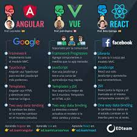

# Section 2: Conceptos generales para empezar con Angular-TypeScript

## Introducción
- Angularjs -> Verisón 1
- Angular -> Versión 2 Up
- Curva de aprendizaje estandar

## Pre-Requisitos para Angular
- JavaScript
- TypeScript

## Porqué se usa TypeScript en Angular
- Trabjar con clases, permite una unifrormidad en las aplicaciones, por ejemplo, agregar:
    - Componentes
    - Servicios
    - Directivas
    - Pipes
- Penmite crear Decoradores.
- Intellisense fuerte.
- Tipado estricto y errores en momento de escritura.
- Inyección de dependencias, acceder a objetos en cualquier clase.

## Mitos de Angular
- No hay mejor framework para la web (Angular, React, Vue y Svelte), depende del uso y la necesidad de cada empresa y/o proyecto.
- Angular es complicado de aprender, depende del historial del background de cada persona.

## Realidades de Angular
- Actualizaciones cada 6 meses.
- Angular 2,4,5,6,7,8,9,10,11,12.... Es el mismo
- Casi todas las linrerías de JS se puede usar en TS.

## Diferencias Frameworks
