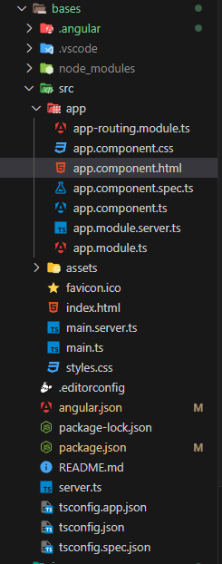

# Sección 4: Angular
Angular es un framework de desarrollo de aplicaciones web desarrollado y mantenido por Google. Es un framework de código abierto y se utiliza para construir aplicaciones web de una sola página (SPA) y aplicaciones empresariales complejas. Angular proporciona un conjunto de herramientas y bibliotecas que facilitan el desarrollo, la prueba y el mantenimiento de aplicaciones web robustas y escalables.

## Framework
- Marco de trabajo estandarizado
- Viene con todo lo que se necesita
- Es modular

## Características clave de Angular

### Componentes
Es un elemento que compone a un todo y si lo llevamos a un punto de vista anatómico del ser humano, este puede ser un brazo, una pierna, etc.

Para este caso, un componente en Angular contiene:
- Un archivo que será nuestro Template (**app.component.html**), el cual es nuestro HTML, que es el que se va a visualizar en la interfaz de usuario, la vista o en términos más simples lo que vas a ver en la página. 

- Un archivo de lógica, la cual es la que pondremos en un archivo .ts (**app.component.ts**), ese archivo debe incluir una clase y esta es la que va a contener las propiedades que se van a usar en la vista (HTML) y los métodos que será las acciones que se ejecutarán en la vista. En este archivo de lógica también se incluye una metadata, que es definida con un decorador,  que identifica a Angular como un componente.

- Un archivo para el CSS (podemos usar un preprocesador como SASS o LESS, por ejemplo, **app.component.css**), donde incluiremos los estilos, lo que nos ayuda a hacer bonita nuestra aplicación.

### Servicios
Los servicios en Angular son objetos reutilizables que realizan funciones específicas y se pueden inyectar en componentes y otros servicios. Básicamente son lugares centrales de información.

### Directivas
Las directivas en Angular permiten extender el HTML con comportamientos personalizados. Angular incluye directivas integradas y permite la creación de directivas personalizadas. 

**Estas pueden ser:**
- **Directivas de Componentes:** Html con algunas funcionalidades
- **Directivas Estructurales:** Modifican el DOM del Html
- **Directivas de Atributos:** Cambian la apariencia

### Rutas
Angular proporciona un sistema de enrutamiento que permite la navegación entre vistas y la gestión de la aplicación de una sola página. Muestra diferentes componentes basadados en el URL del navegador web 

### Módulos
Las aplicaciones Angular están organizadas en módulos, que son bloques funcionales que contienen componentes, servicios y otros recursos relacionados.

**Estas pueden ser:**
- Productos
- Clientes
- Proveedores

## Actualización a partir de la V17
Por defecto los proyectos trabajan sin módulos (module-less), sin emabrgo, se puede configurar de la manera tradicional:
- Ejecutar `ng new <name-project> --standalone false`

## Estructura de un proyecto en Angular

De arriba hacia abajo:
- **.angular:** Manejar la caché de la aplicación
- **node_modules:** Todo proyecto de Javascript posee este directorio donde se almacenan las librerías y dependencias que se descarguen con NPM.
- **src:** Directorio principal del proyecto donde encontramos:
    - **app:** Directorio donde guardaremos todo el código fuente de Angular.
    - **assets:** Directorio para imágenes y otros recursos que la app necesita.
    - **favicon.ico:** Ícono por defecto que tendrá la pestaña del navegador.
    - **index.html:** Archivo HTML principal desde donde se construye toda la aplicación.
    - **main.ts:** Archivo principal para la configuración de Angular.
    - **styles.scss:** Archivo principal de estilos.
    - **test.ts:** Archivo principal para lanzar el ambiente de pruebas de Angular.
- **.editorconfig:** Permite autoformatear los archivos, espacios, indentación, etc. Hay que tener instalado la extensión en el editor.
- **.gitignore:** Indicarle a GIT qué archivos/directorios ignorar.
- **angular.json:** Archivo principal con toda la configuración del proyecto Angular.
- **package-lock.json:** Describe el las dependencias exactas que se generaron en la instalación del proyecto.
- **package.json:** Archivo para el manejo de dependencias, scripts y metadatos relevantes para el proyecto.
- **README.md:** Archivo markdown para la documentación del proyecto.
- **tsconfig.app.json:** Archivo principal para la configuración de TypeScript.
- **tsconfig.json:** Extensión con más configuraciones de TypeScript.
- **tsconfig.spec.json:** Configuración de TypeScript pero para el ambiente de pruebas.

## App Component

## Recursos Adicionales
- [Repo Referencia](https://github.com/Klerith/angular-bases)
- [File Structure](https://angular.io/guide/file-structure)