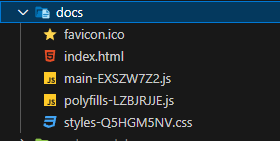
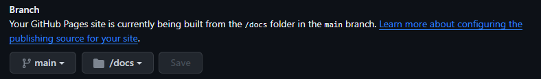
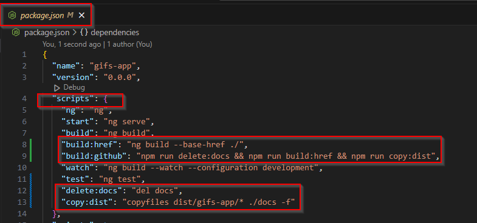
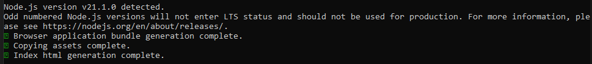
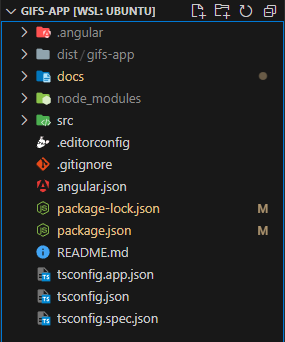

# Sección 6: Despliegues a producción

## Temas de la sección
1. Generar build de producción
2. Desplegarlo rápidamente
3. Netlify
4. GitHub Pages
5. npm Scripts para automatizar el proceso

Aquí aprenderemos como generar el build de producción de nuestra aplicación y la desplegaremos en la web.

El proceso de despliegue en otros servidores es virtualmente el mismo, tomar nuestra carpeta DIST (que contiene la aplicación con archivos HTML, CSS y JS) y desplegarla mediante FTP (preferiblemente sFTP) en el hosting deseado.

## Algunas notas importantes
- Tree checking: Proceso de botar y/o sacudir un árbol para botar las hojas muertas
- Assets: Recursos estáticos que no cambia de la aplicación

## GitHub Pages

### Configurar proyecto de Angular
1. Ejecutar `ng build` para generar los archivos de producción.
2. Mover la carpeta generada por el Build a la raiz del proyecto y renombrar por "docs".



3. En **Github** configurar el Build and deployment en la opción de Branch con "**main**" y "**/docs**"



5. Instalar unas dependencias de desarrollo en la carpeta del proyecto:
    - Ejecutar `npm i del-cli --save-dev` -> Para eliminar archivos/directorios.
    - Luego, ejecutar `npm i copyfiles --save-dev` -> Para copiar archivos/directorios.
6. Modificar el archivo **package.json** agregar las siguientes líneas en la opción de scripts
```json
  "scripts": {
    "build:href": "ng build --base-href ./",
    "build:github": "npm run delete:docs && npm run build:href && npm run copy:dist",
    "delete:docs": "del docs",
    "copy:dist": "copyfiles dist/gifs-app/* ./docs -f"
  }
```



7. Guardar cambios
8. Ejecutar el comando `npm run build:github`





## Comandos utilizados
- `ng build` -> Para generar el Build de producción


## Recursos para hosting
- [Netlify](https://www.netlify.com/)
- [Github Pages](https://pages.github.com/)
- [Del-Cli](https://www.npmjs.com/package/del-cli)
- [Copy Files](https://www.npmjs.com/package/copyfiles)

## Recuros Adicionales